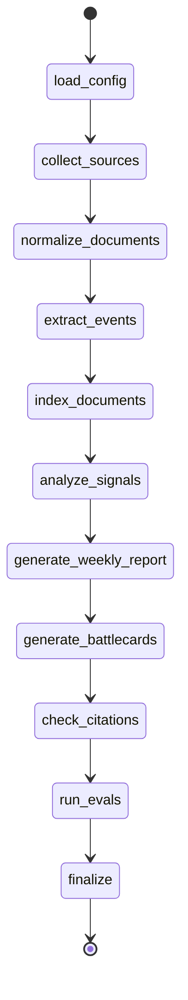

# LangGraph Workflow

> **本文件的完整版本在 [`docs/architecture.md`](./architecture.md) 第 3 节 "Layer 5 — LangGraph Workflow"。** 这里给一个简版的可视化 + 状态字段参考，方便快速查阅。

## 节点一览

`src/marketsignal/agents/graph.py` 暴露 `build_pipeline(use_sample_dataset: bool)`，返回编译后的图。两条流水线共享最后 5 个节点（`generate_weekly_report` → `generate_battlecards` → `check_citations` → `run_evals` → `finalize`），前面的步骤取决于是否使用 sample 数据集。



**Sample 模式**：用 `load_sample` 替换前 5 个节点（`load_config` → `collect_sources` → `normalize_documents` → `extract_events` → `index_documents` → `analyze_signals`），直接从 `data/sample_dataset/*.json` 灌入事件与信号。

## GraphState 字段

定义在 `src/marketsignal/agents/state.py`：

| 字段 | 类型 | 写入节点 | 用途 |
|---|---|---|---|
| `run_id` | str | load_config | 本次执行的根 ID |
| `target_company` | str | load_config | 报告受众（你的公司） |
| `competitor_ids` | list[str] | load_config | 竞品 ID 列表 |
| `source_ids` | list[str] | load_config | 数据源 ID 列表 |
| `time_window_start` / `time_window_end` | str | load_config | 本次 run 的时间窗 |
| `raw_document_ids` | list[str] | collect_sources | 原始抓取文档 |
| `normalized_document_ids` | list[str] | normalize_documents | 清洗后文档 |
| `event_ids` | list[str] | extract_events | 结构化事件 |
| `signal_ids` | list[str] | analyze_signals | 市场信号 |
| `report_ids` | list[str] | generate_weekly_report / generate_battlecards | 报告 |
| `warnings` | list[str] | 任意节点 | 警告（缺 key、降级等） |
| `metrics` | dict[str, float] | run_evals | 5 个 eval 指标 |
| `status` | str | finalize | `pending` / `running` / `completed` / `failed` |

## 节点行为约定

1. **每个节点只读不写外部状态**——所有持久化都走 SQLAlchemy session，由 `get_session()` 上下文管理
2. **节点失败不应该 raise**——把异常 append 到 `warnings`，让 `finalize` 统一决定 `status`
3. **节点间通信只走 `GraphState`**——不要在节点里直接调其他节点的私有函数

## 调试建议

```powershell
# 跑 sample 看完整 trace
$env:PYTHONPATH = "src"
python -m marketsignal.cli run --use-sample-dataset

# 想看每个节点的输入输出，把 log level 调到 DEBUG
$env:LOGURU_LEVEL = "DEBUG"
python -m marketsignal.cli run --use-sample-dataset
```

详细分层与设计理由见 [`docs/architecture.md`](./architecture.md)。
